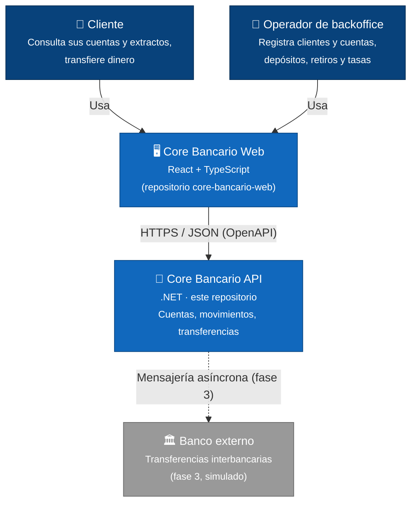

# Core Bancario

Core bancario simplificado en .NET: cuentas en COP y USD, transferencias internas que no se duplican y saldos que se mantienen consistentes bajo concurrencia. Proyecto de portafolio construido para **defender decisiones**: cada regla de negocio tiene una prueba, cada decisión técnica un ADR y cada escenario de falla una demostración automatizada.

> 🚧 En construcción. Estado actual: **Sprint 0 — Fundaciones**. Ver el [roadmap](docs/producto/roadmap.md).

## Qué demuestra

Al terminar la fase 1, este repositorio responde con código y pruebas:

- Por qué el saldo nunca queda negativo aunque lleguen dos transferencias al mismo tiempo.
- Por qué reintentar una transferencia no la ejecuta dos veces.
- Cómo se convierte dinero entre COP y USD sin perder centavos ni reescribir la historia.
- Qué alternativas se descartaron en cada decisión y por qué.

## Contexto del sistema (C4 nivel 1)



## Stack y decisiones

| Tema | Decisión | ADR |
|---|---|---|
| Proceso | Spec-Driven Development con agentes de Claude Code | [0001](docs/adr/0001-guiar-el-desarrollo-con-sdd.md) |
| Arquitectura | Clean Architecture | [0002](docs/adr/0002-clean-architecture-para-el-backend.md) |
| Base de datos | PostgreSQL | [0003](docs/adr/0003-postgresql-como-base-de-datos.md) |
| Acceso a datos | EF Core para escribir, Dapper para leer | [0004](docs/adr/0004-ef-core-para-escritura-y-dapper-para-lectura.md) |
| Repositorios | Backend y frontend separados | [0005](docs/adr/0005-repositorios-separados-backend-y-frontend.md) |
| Pruebas | xUnit v3 con Microsoft Testing Platform | [0006](docs/adr/0006-xunit-v3-con-microsoft-testing-platform.md) |

.NET 10 · xUnit v3 · Testcontainers · Docker · GitHub Actions.

## Cómo ejecutarlo

Requisitos: .NET 10 SDK y Docker.

```bash
cp .env.example .env        # ajusta la contraseña
docker compose up -d        # PostgreSQL local
dotnet build
dotnet test
```

### Cadena de conexión de la API

La API lee `ConnectionStrings:CoreBancario`. **Nunca se guarda en el repositorio.** En desarrollo, usa user-secrets (la API ya tiene su `UserSecretsId`) o una variable de entorno:

```bash
dotnet user-secrets set "ConnectionStrings:CoreBancario" "Host=localhost;Port=5432;Database=core_bancario;Username=core_bancario;Password=<la de tu .env>" --project src/CoreBancario.Api
# o bien: export ConnectionStrings__CoreBancario="Host=localhost;..."
```

En `Development` la API aplica las migraciones al arrancar. Las pruebas de Infrastructure y Api usan Testcontainers, así que necesitan Docker en marcha.

## Cómo se trabaja

Cada feature pasa por cuatro fases con aprobación del autor entre ellas: **Spec → Design → Build (pruebas primero) → Review**. Todo queda en el repositorio:

- [`docs/producto/spec-fase-1.md`](docs/producto/spec-fase-1.md): spec de producto con reglas de negocio, requisitos y escenarios de falla.
- [`docs/adr/`](docs/adr/): decisiones de arquitectura con las alternativas descartadas.
- `specs/NNN-feature/`: spec, plan, tareas, notas de aprendizaje y revisión de cada feature.
- [`docs/sdd/guia.md`](docs/sdd/guia.md): guía del flujo y de los agentes.

## Trade-offs y escenarios de falla

_Se completa a medida que avanzan los sprints: cada escenario de falla tendrá aquí su explicación y su prueba._
